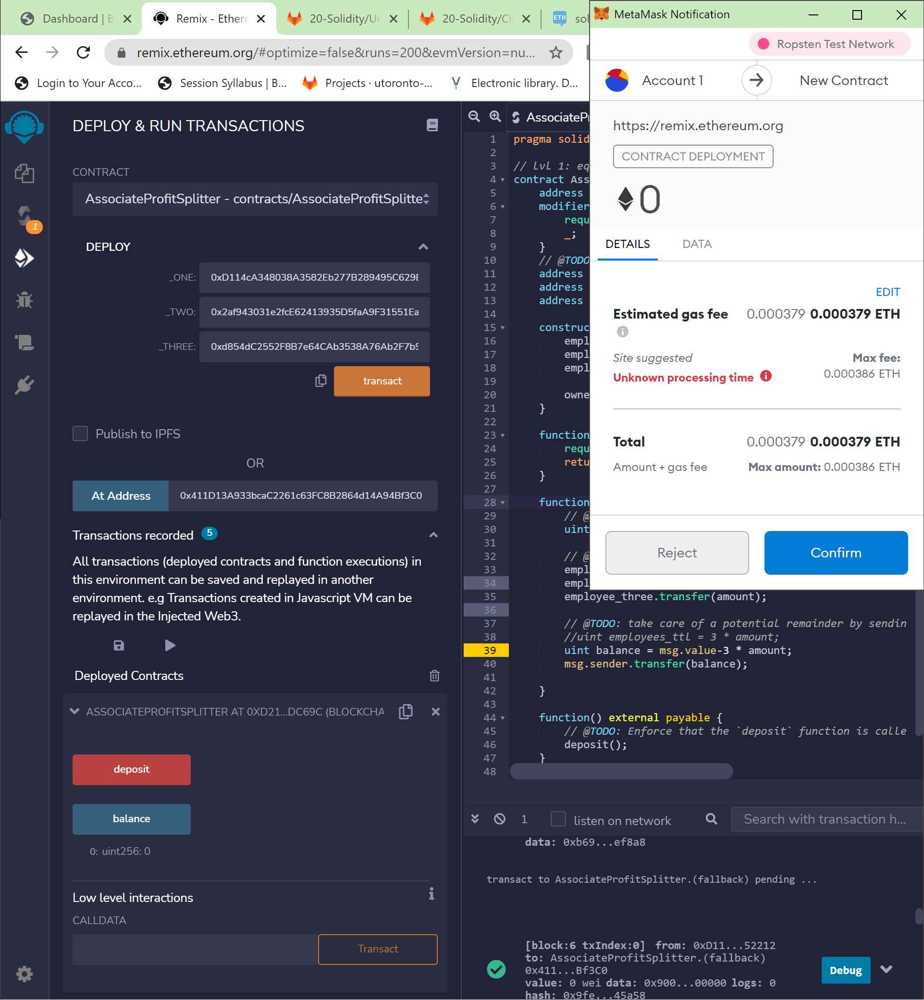

# AssociateProfitSplitter.sol

```solidity
pragma solidity ^0.5.0;

// lvl 1: equal split
contract AssociateProfitSplitter {
    /*
    This contract shares any amount of money equally between 
    three associates and if there's a balance, returns same 
    to the owner of the contract.
    */
    
    // Ensures that only the contract owner is able to execute certain functions
    address owner;
    modifier onlyowner {
        require(owner == msg.sender, "You must be the owner of the contract to perform this function.");
        _;
    }
    
    // Three payable addresses representing `employee_one`, `employee_two` and `employee_three`.
    address payable employee_one;
    address payable employee_two;
    address payable employee_three;
    
    // Constructor is the springboard of the contract.
    constructor(address payable _one, address payable _two, address payable _three) public {
        employee_one = _one;
        employee_two = _two;
        employee_three = _three;
        
        owner = msg.sender;
    }

    // This returns the balance of money left in the contract.
    // This will always be zero since any money received is divided up
    // and the balance returned to the contract owner's wallet.
    function balance() public view returns(uint) {
        require(address(this).balance==0, "There's a problem. The balance must always be zero.");
        return address(this).balance;
    }
    
    // This function does the split for each of the wallets specified
    // based on the modifier used only the owner of the contract (deployer)
    // is able to call it.
    function deposit() public payable onlyowner {
        // @TODO: Split `msg.value` into three
        uint amount = msg.value/3;

        // Transfer the amount to each employee
        employee_one.transfer(amount);
        employee_two.transfer(amount);
        employee_three.transfer(amount);

        // Takes care of a potential remainder by sending back to HR (`msg.sender`)
        //uint employees_ttl = 3 * amount;
        uint balance = msg.value-3 * amount;
        msg.sender.transfer(balance);
    }

    function() external payable {
        // @TODO: Enforce that the `deposit` function is called in the fallback function!
        deposit();
    }
}

```

## Test net accounts

* 0xD114cA348038A3582Eb277B289495C629E452212
* 0x2af943031e2fcE62413935D5faA9F31551Eab307
* 0xd854dC2552F8B7e64CAb3538A76Ab2F7b9D6a224

## The steps

++ After creating the contract
++ ensure you're logged into Metamask
++ lanuch Ganache, connect Metamask and Ganache
++ Deploy your contract and test it.

### Contract deployment



### Deployed Contract


